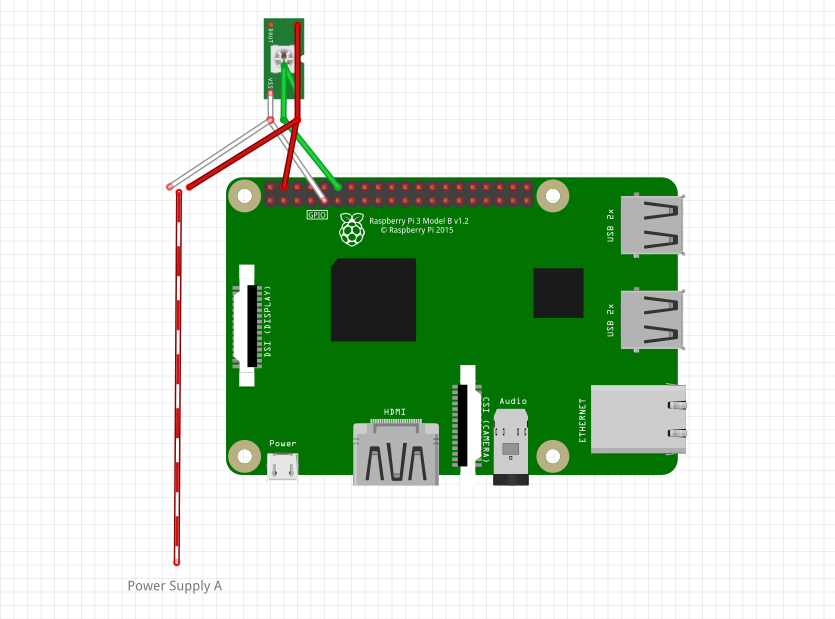

# Pulse of Exploration (mini)


I love [Dan Goods' art installation at JPL "Pulse of Exploration"](https://vimeo.com/93420747). I am constantly amazed that we are constantly recieving little messages from the robotic explorers around the solar system. Its going on right now! I also believe there was a similar project on the internet somewhere in 2019, but I cannot find it. This is similar to the "is the ISS above right now" light.

I love [cool light displays](https://starmaid.github.io/projects/hallie-lights). LEDs are cool and I am obsessed.

This pulls data from [JPL Eyes DSN.](https://eyes.nasa.gov/dsn/dsn.html). This is the backbone of the project.

This project uses [Adafruit CircuitPython](https://learn.adafruit.com/circuitpython-on-raspberrypi-linux/overview). WS2812 light strips and [their python library from adafruit](https://learn.adafruit.com/neopixels-on-raspberry-pi/python-usage). This project uses [the sunrise-sunset API](https://sunrise-sunset.org/api) for automatic day/night modes.

## NEW (Summer 2025): WLED Integration!

Set your new config value `"lights_type": "WledLightStrip"` and set your IP address, and you can play your favorite pulse of exploration animations on any existing WLED lightstrip using the UDP realtime mode. Your on/off state and brightness level from WLED still work, but now the animation can come from your PC running the program! Free up that raspberry pi that was tied to a lights display, that was totally overkill. 

If people want to use this, I may set up a docker container that you can just launch as part of your own home cluster.

## NEW (Summer 2024): Home Assistant Intgration!

My last series of updates add the ability to remotely turn on and off the lights, without having to log into the pi, or pull any plugs. These commands can be run from a computer on the same network, or you can add them to a home automation suite like [Home Assistant](https://www.home-assistant.io/). First you have to enable the port in your Pulse's `config.json` file:

```json
    "expose_net_switch": true,
    "expose_net_port": 9996
```

And then add this section to your Home Assistant `configuration.yaml`: 

```yaml
command_line:
  - switch:
        name: The Pulse
        unique_id: pulse_of_exploration 
        command_on: 'echo "ON" | nc dsn.local 9996'
        command_off: 'echo "OFF" | nc dsn.local 9996'
        command_state: 'echo "STATUS" | nc dsn.local 9996'
        value_template: '{{ value == "ON" }}'
```

## Who made these animation themes?

Check out the README files in each theme folder!

## Where are you in development??

Currently done! If you have issues or improvements, add em to [GitHub Issues](https://github.com/starmaid/pulseofexploration/issues) and I'll take a look.

## How to Build your Own


### Parts

| Item   | Avg. Cost |
| ------ |----------|
| Raspberry Pi 3b+ |  $30 |
| 4GB or larger microSD card | $8 |
| 2A or more power adapter + cable | $5 |
| WS2812b 5V light strip | $10 |

**NOTE (Spring 2022):** There is currently a global shortage of Raspberry Pi devices. It is more likely you will be able to pick one up from a local computer store for MSRP than online.

**NOTE (Summer 2022):** [The latest release, raspios bullseye, has removed the default user `pi` and its default password.](https://www.raspberrypi.com/news/raspberry-pi-bullseye-update-april-2022/) I have updated the instructions to match, but there may be some issues that I don't catch.

### Tools

- MicroSD adapter for your computer
- Knife
- Electrical tape
- (Soldering Iron, possibly)

### Deciding on a Build

First, you have to decide what your setup will look like. This guide will focus on a small desktop setup, but it is possible to run this program on any length of LED strip - provided you have the power supply to support it.

Each segment, the ground, signal, and sky, is optional. This will be presented to you during setup, but it should be decided before purchasing supplies. I had a few designs in mind while working.


There are three options for wiring the lights. 

1. Running power through the Raspberry Pi. This can power a few lights, but you hit current limits on the board.

 

2. You can use a larger power supply, and wire the lights and Pi in parallel. This may require some of your own electric work.



3. You can also use two separate power supplies for the Pi and lights. This wiring pattern allows you to turn the lights off without turning off the Pi.


| Board  | Power Draw with mild load (mA) | Lights you could power through the board with a 2 A Supply |
| ------ | --------------- | ---------------------- |
| Zero W | 300     | 30 |
| 3 B+   | 700     | 22 |
| 4 B    | 800     | 20 |

If you are integrating this with another project, remember that the WS2812b lights need a pin that can output a PCM (or PWM, as I learned it) signal. By default the config uses `GPIO 18`, but see the [pinout](https://pinout.xyz/pinout/pcm#) for other options.

### Steps

1. First, pick a Raspberry Pi. I have some 3B+'s lying around, so that's what I'll be using. Most models will work. If you are purchasing one for this project, I reccomend the Pi Zero W.

2. Download the [the Raspberry Pi Imager](https://www.raspberrypi.com/software/) to your computer.

4. If you are using a Windows PC and don't have access or simply dont want to dig into your router's DCHP assignments (or don't know what I just said), download [bonjour services](https://support.apple.com/kb/DL999?locale=en_US).

5. Connect the MicroSD card to your computer. Use the Raspberry Pi Imager to select `Raspberry Pi OS (Other) -> Raspberry Pi OS Lite`

6. Click the Gear icon to set up the hostname, username, password, wireless LAN, and locale settings.

7. Flash the SD card image.

8. Remove the MicroSD card from your computer and put it in the Raspberry Pi.

9. Power on the Raspberry Pi by connecting the power cable. Wait for it to connect to your network (may take up to a minute or two).

10. Open a terminal on your computer (PowerShell, Terminal).

11. Connect to the Raspberry Pi via SSH. In the terminal, enter your credentials (replacing `$USER` and `$HOSTNAME` with the username and hostname you set in the earlier step)

    ```
    ssh $USER@$HOSTNAME.local
    ```

12. Enter `yes` to the message that may appear:

    ```
    The authenticity of host 'raspberrypi.local (fe80::5865:c6fa:3262:1820%3)' can't be established.
    ECDSA key fingerprint is SHA256:G1RRXKWJnsGA7j/0oRljfqipTu5YVfbcdddXS7j8n74. 
    Are you sure you want to continue connecting (yes/no/[fingerprint])? 
    ```

13. Login to your user account with the password you set. While you type the password, the characters will not appear.

13. Install git.

    ```
    sudo apt install git
    ```

14. Download the files from this repository.

    ```
    git clone https://github.com/starmaid/pulseofexploration.git
    ```

15. Navigate to, make executable, and run the install script. Get a cup of tea, it will take some time.

    ```
    cd ./pulseofexploration
    chmod +x ./install.sh
    ./install.sh
    ```

16. Turn off the Raspberry Pi, and then disconnect the power. 

    ```
    sudo poweroff
    ```

    Wait for the Green STATUS LED to blink 10 times and then you can disconnect the power cable.

The next time you power on the RPi, it should run the lights sequence! You can test it before integrating with your system.

### Hardware Assembly

This is a series of steps that are a little complex to save the effort of learning to solder. If you have access to a soldering iron and different pin connectors, I recommend making your own wiring harness setup. However, that doesn't apply to most of my friends who will be reading this, so give it a shot.

1. Take your knife and pop the pins from the LED strip connector. You just have to press the raised section down, and then push out.

    

    This is the raised section you are pushing down.

    

2. Wrap the end of the pin with electrical tape.

    

    

3. Connect the wires to the Pi. Check the wiring diagram to verify the pins.

    

If you have issues, [submit an issue here on GitHub](https://github.com/starmaid/pulseofexploration/issues), or message/email me.

This is what a wiring harness could look like, if you have a 0.1" connector kit.


## My Build

My own build was made out of Dollar Tree Redi-Board and hot glue, a good cheap building and drafting technique.


For this build, I used wiring diagram 1, with exactly 30 lights. I'm pushing my recommendations, but that's my responsibility if I burn out my pi.


## Config File

This is the file you modify to configure your lights.


| Variable | Effect    |
|----------|-----------|
| lights   | the number of LEDs in each segment.
| pin      | Which DIO pin the lights are connected to. Must be a PWM pin. |
| brightness | Max brightness percentage for the lights. Scales all colors. |
| RGBW     | Set `true` if you have RGBW instead of just RGB lights.
| groundFirst | set `true` if the ground segment is closer to the RPi (as opposed to the sky) |
| framerate | framerate for updating the sky LEDs |
| theme | Set to the name of the folder your theme resides in inside `./data` |
| latitude | Latitude of your location to use in daylight calculation. |
| longitude | Longitude of your location to use in daylight calculation. |

## Power Consumption Details

This program barely consumes any resources - 3% normally, 9% during web pulls (once every 5 sec), and maximum 30% load during startup, and maybe 30 Mb RAM. WiFi module usage exists, but is low, again only polling by default every 5 seconds. 

WS2812b strip, draws about 55 mA/px

| Board  | Power Draw with mild load (mA) | Lights you could power through the board with a 2 A Supply |
| ------ | --------------- | ---------------------- |
| Zero W | 300     | 30 |
| 3 B+   | 700     | 22 |
| 4 B    | 800     | 20 |

Remember, this is with no keyboard or display, which would increase draw. This forces you to setup and control it over SSH, which is easy.

The Zero does not have a 5V regulator that limits how much current you can pull through the traces, which gives you more flexibility.
