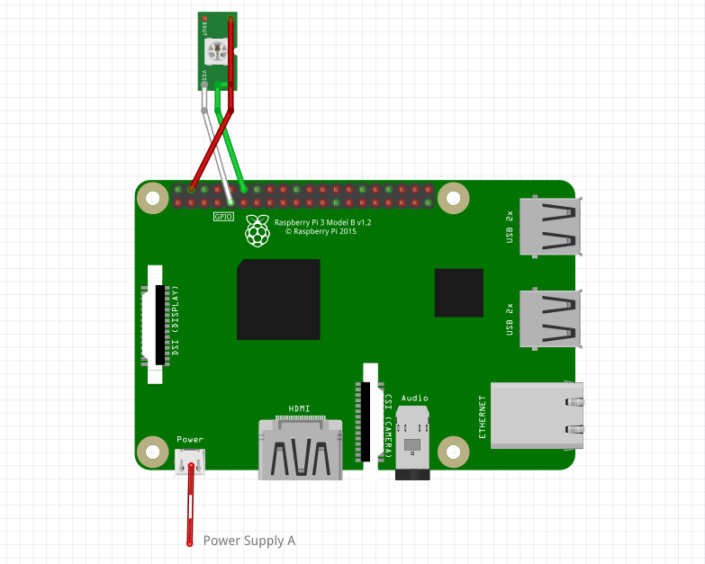

# Pulse of Exploration (mini)

I love [Dan Goods' art installation at JPL "Pulse of Exploration"](https://vimeo.com/93420747)

I love [cool light displays](https://starmaid.github.io/projects/hallie-lights)

This pulls data from [JPL Eyes DSN.](https://eyes.nasa.gov/dsn/dsn.html)

This project uses [Adafruit CircuitPython](https://learn.adafruit.com/circuitpython-on-raspberrypi-linux/overview)

WS2812 light strips and [their python library from adafruit](https://learn.adafruit.com/neopixels-on-raspberry-pi/python-usage)

## Who made these animation themes?

Check out the README files in each theme folder!

## Where are you in development??

Variable brightness for LEDS

make a setup script for the user

make a cool ground, reactive to time of day

## How to Build your Own

### Deciding on a Build

First, you have to decide what your setup will look like. This guide will focus on a small desktop setup, but it is possible to run this program on any length of LED strip - provided you have the power supply to support it.

Each segment, the ground, signal, and sky, is optional. This will be presented to you during setup, but it should be decided before purchasing supplies. Here are some ideas for setups:

*[PUT BUILD IMAGES HERE]*

There are two options for wiring the lights. Running power through the Raspberry Pi, or using another power supply (or simply a larger supply with a different wiring).

 


This wiring pattern allows you to turn the lights off without turning off the Pi, which is handy if you have, say, a lightswitch tied to an outlet (like I do). Pulling the plug on a running RPi is never a good idea, as it can corrupt your filesystem and youll have to re-setup the SD card. Its always good practice to `sudo poweroff` from the command line.

| Board  | Power Draw with mild load (mA) | Lights you could power through the board with a 2 A Supply |
| ------ | --------------- | ---------------------- |
| Zero W | 300     | 30 |
| 3 B+   | 700     | 22 |
| 4 B    | 800     | 20 |

If you are integrating this with another project, remember that the WS2812b lights need a pin that can output a PCM (or PWM, as I learned it) signal. By default the config uses `GPIO 18`, but see the [pinout](https://pinout.xyz/pinout/pcm#) for other options.

### Parts

| Item   | Avg. Cost |
| ------ |----------|
| Raspberry Pi Zero W |  $10 |
| 4GB or larger microSD card | $8 |
| 2A or more power adapter + cable | $5 |
| WS2812b 5V light strip | $10 |

**NOTE (Spring 2022):** There is currently a global shortage of Raspberry Pi devices. It is more likely you will be able to pick one up from a local computer store for MSRP than online.

### Tools

- MicroSD adapter for your computer
- Wire cutters
- Soldering Iron
- Knife

### Steps

1. First, pick a Raspberry Pi. I have some 3B+'s lying around, so that's what I'll be using. Most models will work. If you are purchasing one for this project, I reccomend the Pi Zero W.

2. Download the latest [Raspberry Pi OS Lite](https://www.raspberrypi.com/software/operating-systems/).

3. If you don't already have a software to flash disk images with, download [Etcher](https://www.balena.io/etcher/).

4. If you are using a Windows PC and don't have access or simply dont want to dig into your router's DCHP assignments (or don't know what I just said), download [bonjour services](https://support.apple.com/kb/DL999?locale=en_US).

5. Connect the MicroSD card to your computer. Use Etcher to flash the OS image you just downloaded.

6. Download from this GitHub page [wpa_cupplicant.conf](https://raw.githubusercontent.com/starmaid/pulseofexploration/master/setup/wpa_supplicant.conf) and [ssh](https://raw.githubusercontent.com/starmaid/pulseofexploration/master/setup/ssh). Right click and use 'save page as' to download them. `ssh` is an empty file.

7. Using a text editor (like notepad), edit the `wpa_supplicant.conf` file to include the credentials for your wifi network.

8. Copy both the `wpa_supplicant.conf` and `ssh` files into the `X:/boot` drive that appears after flashing the SD card.

9. Remove the MicroSD card from your computer and put it in the Raspberry Pi.

10. Power on the Raspberry Pi by connecting the power cable.

11. Open a terminal on your computer (PowerShell, Terminal).

12. Connect to the Raspberry Pi via SSH. In the terminal, enter 

    ```
    ssh pi@raspberrypi.local
    ```

13. Enter `yes` to the message that may appear:

    ```
    The authenticity of host 'raspberrypi.local (fe80::5865:c6fa:3262:1820%3)' can't be established.
    ECDSA key fingerprint is SHA256:G1RRXKWJnsGA7j/0oRljfqipTu5YVfbcdddXS7j8n74. 
    Are you sure you want to continue connecting (yes/no/[fingerprint])? 
    ```

14. Login to the `pi` account. The default password is `raspberry`. While you type the password, the characters will not appear.

15. Enter `pwd` and follow the instructions to change the default password.

16. Install git to download the files from this repository.

    ```
    sudo apt install git
    ```

17. Download the files from this repository.

    ```
    git clone https://github.com/starmaid/pulseofexploration.git
    ```

18. Navigate to and run the install script.

    ```
    cd ./pulseofexploration
    chmod +x ./install.sh
    ./install.sh
    ```

19. Turn off the Raspberry Pi, and then disconnect the power.

    ```
    sudo poweroff
    ```

20. Take your knife and pop the pins from the LED strip connector

21.

## Power Consumption Details

This program barely consumes any resources - 3% normally, 9% during web pulls (once every 5 sec), and maximum 30% load during startup, and maybe 30 Mb RAM. WiFi module usage exists, but is low, again only polling by default every 5 seconds. 

WS2812b strip, draws about 55 mA/px

| Board  | Power Draw with mild load (mA) | Lights you could power through the board with a 2 A Supply |
| ------ | --------------- | ---------------------- |
| Zero W | 300     | 30 |
| 3 B+   | 700     | 22 |
| 4 B    | 800     | 20 |

Remember, this is with no keyboard or display, which would increase draw. This forces you to setup and control it over SSH, which is easy.

The Zero does not have a 5V regulator that limits how much current you can pull through the traces, which gives you more flexibility.