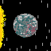
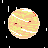
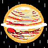
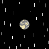

# Default Theme Pack

This pack was made by me. Feel free to copy it and make your own packs that have a few changes.

The `theme.json` file contains the majority of active ships and some sensible default bindings.

# Previews

