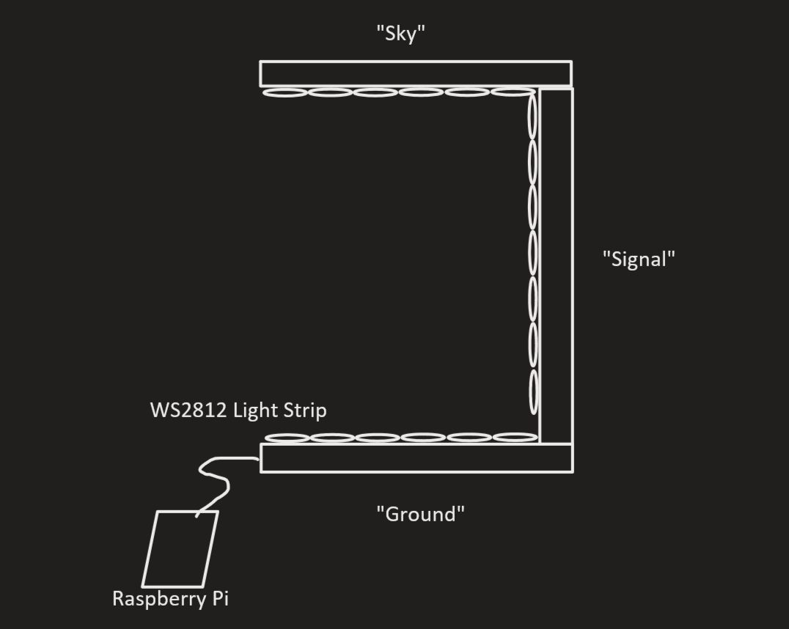
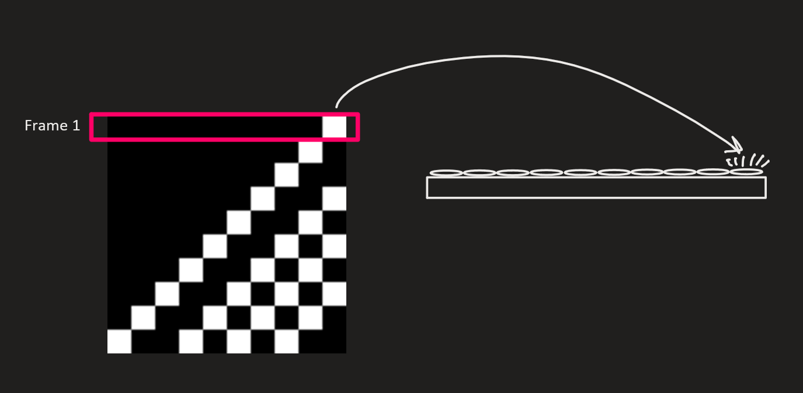
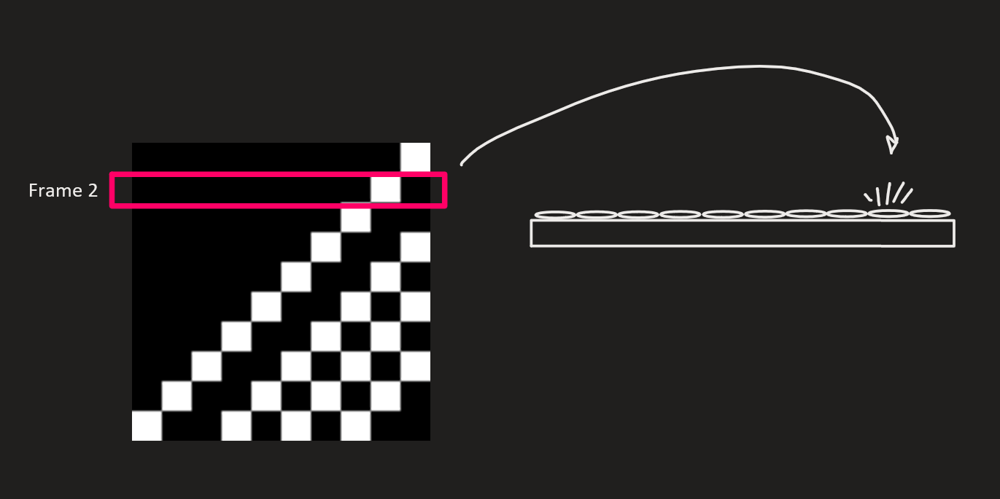
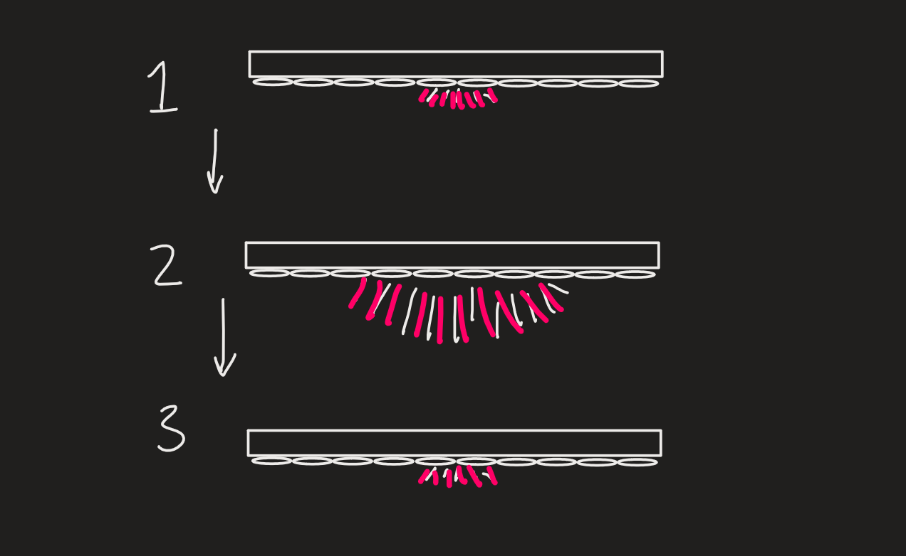
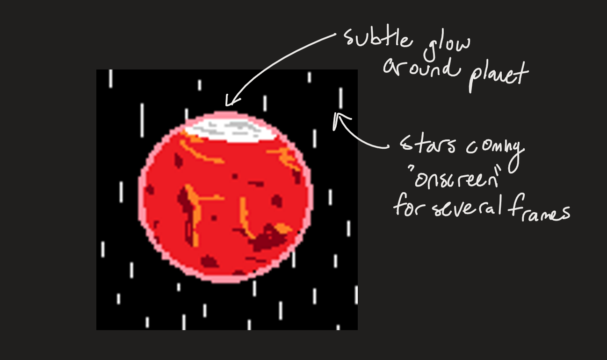
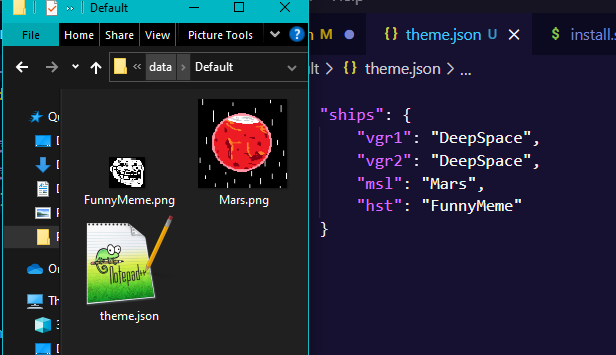

# Data and Themes

## Brief Project Overview

I wanted to create a 1-D light strip as a vizualizer for the DSN Now data. This light strip is split into three segments: Ground, Signal, and Sky.



When a signal comes in on the DSN, I want to play an animation in the night sky that tells where the signal is coming from; LEO, Moon, Mars, Jupiter, wherever. 

However, I didn't want to hand-write RGB values in arrays. That gets tedious and is not necessary when we have a way to easily make and store sets of color data - 2-D images! So, each row of an image can be played sequentially on our row of lights.





...and so on. Of course, it would be obnoxious to force the images to be the same dimensions of the actual light strip, so I have a scaling function so that light strips that are smaller/larger work well. 

One effect that I wanted was a glowing effect that radiates from the center for a planet 'looming overhead'. 



However, I realized that this animation, when represented as an image, is a circle. How fitting would it be then, if the animations themselves were art of the planets!



Of course, it doesnt have to be a planet. The animation can be anything fun. For example, you could blink morse code on the lights, or just do cool patterns. You just have to define the craft that uses that image filename in the theme config file.

## The Theme Config File

The `theme.json` file defines which crafts use which images. JSON files are plaintext files that can be opened in notepad or any other text editor. There are some built-in animations, like DeepSpace and NearSpace, but others are reading from images that must be in the folder. Each folder is a self-contained theme, and cannot reference images from other themes.

```
/data
├── Default
│   ├── Earth.png
│   ├── Jupiter.png
│   ├── Mars.png
│   ├── Mercury.png
│   ├── Neptune.png
│   ├── Pluto.png
│   ├── Saturn.png
│   ├── Uranus.png
│   ├── Venus.png
│   └── theme.json
├── Kore
│   ├── Mercury.png
│   └── theme.json
├── Silly
│   ├── FunnyMeme.png
│   └── theme.json
├── README.md
├── Transmission.png
└── config.json
```

Inside the `theme.json` file, there is a list of crafts. These are the abbreviations given in The [DSN Now Config File](https://eyes.nasa.gov/dsn/config.xml). Any ship that is in that file could appear, but there are several decommissioned probes and rovers that are no longer in service still listed.



Here, the Hubble Space Telescope 'hst' will use the image filename 'FunnyMeme' (.png).

After creating this theme, you must modify your main `config.json` file to reflect the theme you wish to use on next startup.

```
{
    "lights": {
        "ground": 10,
        "signal": 10,
        "sky": 10
    },
    "rgb": true,
    "groundFirst": true,
    "framerate": 10,
    "theme": "Default"
}
```

The name of the theme is the name of the folder it is contained in.

## Guidelines for Submitting a Theme

**Images must be PNG format, 32 bit color.** This is the default color depth for most every program, but Photoshop has options to use different bit sizes.

**Transparency is ignored** - it can exist but the raw pixel color will be used. Fully transparent with no color is off (black).

It is reccomended that images be relatively small. Most light displays will have 10-60 pixels in a sky segment. Higher resolution images will appear confusing when downsampled, and may not carry their meaning along well. **The reccomended width is 100 px.** Single pixel width elements may be lost on small installations, but this gives headroom for people with larger 'displays'. 

Height is proportional to duration of the animation. Default animation speed is 10 FPS, so a 100 px tall image will last 10 seconds. This can be changed in the `config.json` file. **The reccomended height is 100px.**

If you know what you are doing, you can submit a pull request to this repo with your new theme. If that sentence doesn't make any sense, just message me on discord.

If people want it, I may add the capability to add a Python module for the light definitions in the theme folder. Currently, a theme can be made by inherting from the `lights.LightSequence` class, but it must exist in the `lights.py` file. If people want that functionality, let me know.